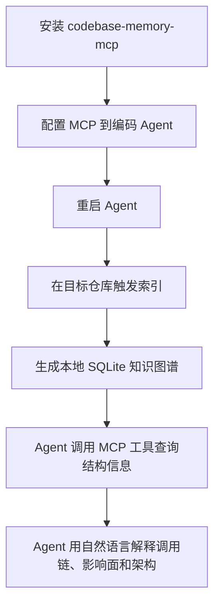

# codebase-memory-mcp 安装与使用指南

> 快照日期：2026-06-21  
> 适用目的：快速试用 [codebase-memory-mcp](https://github.com/DeusData/codebase-memory-mcp)，为代码库建立本地知识图谱，并通过 MCP 给 Claude Code、Codex CLI、Gemini CLI 等编码 Agent 提供结构化检索能力。  
> 注意：本文基于官方 README、安装脚本和 GitHub Release 公开信息整理，尚未在本仓库实装验证。

## 它适合解决什么问题

codebase-memory-mcp 更适合做「本地代码知识库基础设施」，而不是单纯的可视化导览工具：

- 大仓库或多语言仓库中，想减少 Agent 反复 `grep`、`Read` 文件的探索成本。
- 想查询函数、类、调用链、入口点、HTTP 路由、跨服务关系、死代码和影响面。
- 希望同一个 MCP 服务可以被多个编码 Agent 使用。
- 需要本地处理代码，不想为了代码图谱额外配置 API key、Docker 或外部向量服务。
- 希望在 Windows、macOS、Linux 上用单个预编译二进制快速安装。

不太适合：

- 只想给新人看一张可交互架构图，而不接入编码 Agent。
- 项目很小，直接读源码已经足够快。
- 无法接受安装工具写入 Agent 配置、指令文件或 hook；这种情况下应使用 `--skip-config`，只安装二进制后手动配置。

## 工作方式



官方说明中，codebase-memory-mcp 自身不包含 LLM。它负责建立和查询结构化知识图谱；自然语言理解、问题拆解和最终回答由 MCP 客户端里的 Agent 完成。

## 安装方式

### 方式一：macOS / Linux 一行安装

标准版本：

```bash
curl -fsSL https://raw.githubusercontent.com/DeusData/codebase-memory-mcp/main/install.sh | bash
```

带图谱可视化 UI 的版本：

```bash
curl -fsSL https://raw.githubusercontent.com/DeusData/codebase-memory-mcp/main/install.sh | bash -s -- --ui
```

只安装二进制，不自动写入 Agent 配置：

```bash
curl -fsSL https://raw.githubusercontent.com/DeusData/codebase-memory-mcp/main/install.sh | bash -s -- --skip-config
```

指定安装目录：

```bash
curl -fsSL https://raw.githubusercontent.com/DeusData/codebase-memory-mcp/main/install.sh | bash -s -- --dir="$HOME/.local/bin"
```

### 方式二：Windows PowerShell 安装

更稳妥的做法是先下载、审计，再执行：

```powershell
Invoke-WebRequest `
    -Uri https://raw.githubusercontent.com/DeusData/codebase-memory-mcp/main/install.ps1 `
    -OutFile install.ps1

notepad .\install.ps1
.\install.ps1
```

安装带图谱可视化 UI 的版本：

```powershell
.\install.ps1 --ui
```

只安装二进制，不自动写入 Agent 配置：

```powershell
.\install.ps1 --skip-config
```

指定安装目录：

```powershell
.\install.ps1 --dir=C:\Tools\codebase-memory-mcp
```

官方 Windows 安装脚本默认安装到：

```text
%LOCALAPPDATA%\Programs\codebase-memory-mcp\codebase-memory-mcp.exe
```

脚本会把安装目录加入用户级 `PATH`。执行完后，需要重启终端和编码 Agent。

### 方式三：手动下载 Release

如果不想直接运行远程脚本，可以从 [latest release](https://github.com/DeusData/codebase-memory-mcp/releases/latest) 下载对应平台包：

- macOS / Linux：`codebase-memory-mcp-<os>-<arch>.tar.gz`
- Windows：`codebase-memory-mcp-windows-amd64.zip`
- 带 UI 版本：文件名中带 `codebase-memory-mcp-ui`

手动安装流程：

1. 下载压缩包和 `checksums.txt`。
2. 校验 SHA-256。
3. 解压到本地目录。
4. 将 `codebase-memory-mcp` 或 `codebase-memory-mcp.exe` 加入 `PATH`。
5. 执行 `codebase-memory-mcp install` 配置 Agent，或手动写 MCP 配置。

## Agent 配置

自动安装脚本会尝试检测并配置多个编码 Agent。官方 README 列出的支持对象包括 Claude Code、Codex CLI、Gemini CLI、Zed、OpenCode、Antigravity、Aider、KiloCode、VS Code、OpenClaw 和 Kiro。

如果你不想让安装脚本自动修改配置，可以使用 `--skip-config`，然后手动把 MCP server 加到目标 Agent 的 MCP 配置里。

通用 MCP 配置形态如下：

```json
{
    "mcpServers": {
        "codebase-memory-mcp": {
            "command": "/path/to/codebase-memory-mcp",
            "args": []
        }
    }
}
```

配置后重启 Agent，并在 Agent 中检查 MCP server 是否出现。

## 基础使用

### 1. 重启编码 Agent

安装或修改 MCP 配置后，先重启 Claude Code、Codex CLI 或其他 Agent。

### 2. 在目标仓库触发索引

进入目标代码库后，直接让 Agent 执行类似任务：

```text
Index this project
```

如果已启用自动索引，新项目会在首次连接时自动索引；已索引项目会注册后台 watcher，用于基于 Git 变更的增量同步。

开启自动索引：

```bash
codebase-memory-mcp config set auto_index true
```

设置自动索引文件数量上限：

```bash
codebase-memory-mcp config set auto_index_limit 50000
```

### 3. 让 Agent 查询代码结构

适合提问：

- 「项目入口在哪里？从入口到核心执行路径是什么？」
- 「谁调用了 `ProcessOrder`？」
- 「这个 API 路由最终调用了哪些 service？」
- 「我改这个函数会影响哪些模块？」
- 「找出可能的死代码。」
- 「总结当前仓库的架构边界、热点模块和调用层次。」

典型链路是：Agent 把自然语言问题转成 MCP 工具调用，codebase-memory-mcp 返回结构化结果，Agent 再用中文解释。

### 4. 命令行查询

官方 README 提到它也支持 CLI 模式，例如：

```bash
codebase-memory-mcp cli search_graph '{"name_pattern": ".*Handler.*"}'
```

这适合在不经过 Agent 的情况下做快速结构检索。

## 图谱可视化 UI

如果安装的是 UI 版本，可以启动本地可视化：

```bash
codebase-memory-mcp --ui=true --port=9749
```

然后打开：

```text
http://localhost:9749
```

截至本文快照，最新 Release `v0.8.1` 说明中提到 UI 服务只绑定 `127.0.0.1`，并重写了第一方 HTTP server。

## 更新与卸载

更新：

```bash
codebase-memory-mcp update
```

卸载 Agent 配置、skills、hooks 和 instructions：

```bash
codebase-memory-mcp uninstall
```

注意：官方 README 说明 `uninstall` 不会删除二进制文件或 SQLite 数据库；如果要完全清理，需要再手动删除安装目录和缓存目录。

## 数据与团队共享

官方 README 说明，索引数据默认持久化到本地缓存目录：

```text
~/.cache/codebase-memory-mcp/
```

如果希望团队成员复用索引结果，可以提交仓库内的压缩图谱文件：

```text
.codebase-memory/graph.db.zst
```

建议策略：

- 个人试用阶段：先不要提交 `.codebase-memory/`。
- 团队统一 POC：可以考虑提交 `.codebase-memory/graph.db.zst`，但要先评估体积和源码结构泄露风险。
- 不想提交共享图谱：把 `.codebase-memory/` 加入 `.gitignore`。

## 验收清单

安装后按下面清单验证：

- [ ] `codebase-memory-mcp --version` 能正常输出版本。
- [ ] 重启 Agent 后，MCP server 能被识别。
- [ ] 在小仓库触发索引成功。
- [ ] Agent 能回答入口点、调用链、影响面等结构化问题。
- [ ] 修改文件后，索引能自动同步，或重新索引后能反映最新变更。
- [ ] 如果安装 UI 版本，`http://localhost:9749` 能打开图谱界面。
- [ ] 明确 `.codebase-memory/` 和本地缓存是否需要忽略、提交或清理。

## 常见风险

- **安装脚本会改配置**：官方 README 明确提示该工具会读取代码库并写入 Agent 配置文件。生产环境建议先审计脚本，或用 `--skip-config`。
- **结构图谱不等于源码事实**：调用链、影响面和死代码检测应作为线索，关键结论仍要回到源码和测试验证。
- **索引可能过期**：自动同步依赖 watcher 和 Git 变更检测；如果结果异常，先重新索引再判断。
- **共享图谱可能泄露结构信息**：`.codebase-memory/graph.db.zst` 即使不是源码，也可能暴露模块、函数、路由和依赖关系。
- **Windows SmartScreen 可能拦截**：官方 README 提到 Windows 可能出现 SmartScreen 警告，建议校验 `checksums.txt` 后再执行。

## 建议 POC 顺序

1. 先用 `--skip-config` 安装，确认二进制和版本正常。
2. 手动配置到一个 Agent，避免一次性改多个工具配置。
3. 选一个中等规模仓库，问 5 个固定问题：
    - 主入口在哪里？
    - 核心调用链是什么？
    - 修改某个函数会影响哪里？
    - 哪些 HTTP 路由或 service 关联最密？
    - 是否能找出明显死代码？
4. 对每个回答抽样回到源码验证。
5. 如果准确率和节省探索成本都明显，再考虑开启 `auto_index` 或团队共享图谱。

## 事实来源

- [codebase-memory-mcp README](https://github.com/DeusData/codebase-memory-mcp)：项目定位、安装方式、Agent 支持、MCP 工具、索引能力、UI、数据存储、更新和卸载说明。
- [install.sh](https://raw.githubusercontent.com/DeusData/codebase-memory-mcp/main/install.sh)：macOS / Linux 安装参数、下载校验、默认安装目录、`--ui`、`--skip-config` 和 `--dir` 说明。
- [install.ps1](https://raw.githubusercontent.com/DeusData/codebase-memory-mcp/main/install.ps1)：Windows 安装参数、默认安装目录、校验、自动配置和用户级 `PATH` 写入说明。
- [Release v0.8.1](https://github.com/DeusData/codebase-memory-mcp/releases/tag/v0.8.1)：截至 2026-06-21 查询到的最新 Release、UI HTTP server、本地绑定、安全扫描和更新说明。
