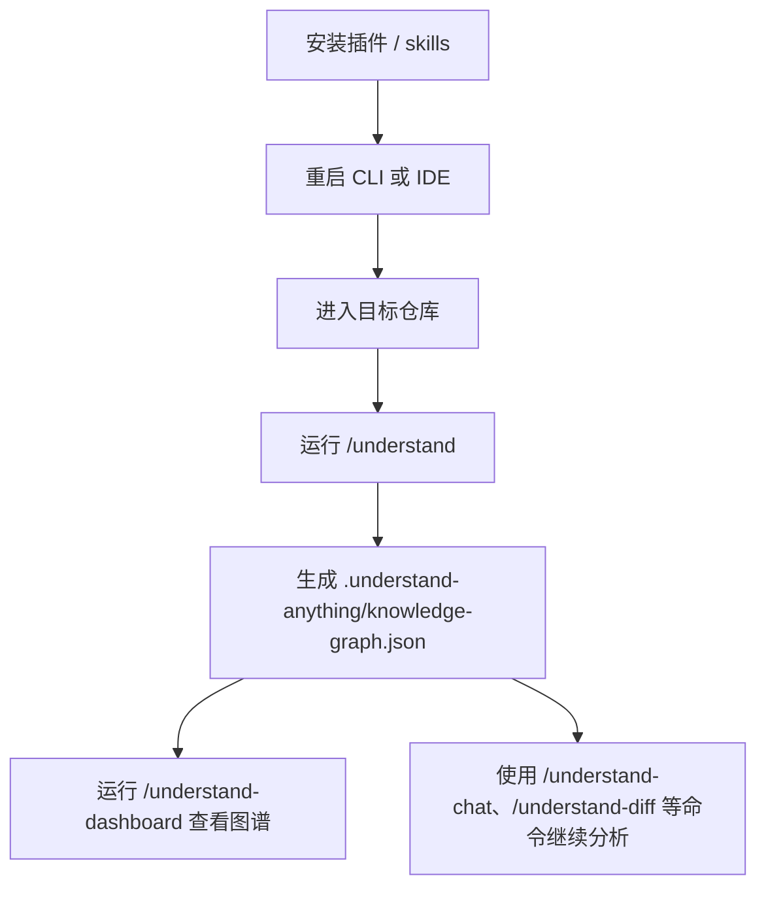

# Understand-Anything 安装与使用指南

> 快照日期：2026-06-21  
> 适用目的：快速试用 [Understand-Anything](https://github.com/Egonex-AI/Understand-Anything)，把代码库、知识库或文档转换成交互式知识图谱，用于项目理解、架构导览和 onboarding。  
> 注意：本文只整理官方 README 和安装脚本中的公开说明，尚未在本仓库实装验证。

## 它适合解决什么问题

Understand-Anything 适合「先看懂项目」而不是「直接提升日常编码效率」：

- 新接手一个陌生仓库，想快速看清文件、函数、类和依赖关系。
- 想通过 dashboard 浏览代码结构、架构层次和业务域。
- 想让 AI 回答「某个业务流程怎么走」「某个文件负责什么」这类理解型问题。
- 想生成 onboarding guide、guided tour 或影响分析。

官方 README 说明：它会分析项目，通过 multi-agent pipeline 构建知识图谱，并提供可交互 dashboard；知识图谱会保存到 `.understand-anything/knowledge-graph.json`。

## 使用流程



## 安装方式

### 方式一：Claude Code 原生插件安装

如果使用 Claude Code，官方推荐通过插件市场安装：

```text
/plugin marketplace add Egonex-AI/Understand-Anything
/plugin install understand-anything
```

安装后重启 Claude Code，再进入目标仓库使用。

### 方式二：Codex / Gemini CLI / OpenCode 等平台安装

官方安装脚本支持多个平台，包括 `codex`、`gemini`、`opencode`、`openclaw`、`antigravity`、`vibe`、`vscode`、`hermes`、`cline`、`kimi`、`trae`、`nanobot`、`kiro` 等。

macOS / Linux：

```bash
curl -fsSL https://raw.githubusercontent.com/Egonex-AI/Understand-Anything/main/install.sh | bash -s codex
```

如果不传平台参数，脚本会提示选择平台：

```bash
curl -fsSL https://raw.githubusercontent.com/Egonex-AI/Understand-Anything/main/install.sh | bash
```

Windows PowerShell（官方一行命令）：

```powershell
iwr -useb https://raw.githubusercontent.com/Egonex-AI/Understand-Anything/main/install.ps1 | iex
```

更安全的 Windows PowerShell 做法：先下载、审计，再执行：

```powershell
Invoke-WebRequest -UseBasicParsing `
    -Uri https://raw.githubusercontent.com/Egonex-AI/Understand-Anything/main/install.ps1 `
    -OutFile install.ps1

notepad .\install.ps1
.\install.ps1 codex
```

安装脚本会把仓库克隆到用户目录下的 `.understand-anything/repo`，并为所选平台创建对应的 skills / 插件链接。安装后需要重启 CLI 或 IDE。

### 更新与卸载

macOS / Linux：

```bash
# 更新
~/.understand-anything/repo/install.sh --update

# 卸载 Codex 平台链接
~/.understand-anything/repo/install.sh --uninstall codex
```

Windows PowerShell：

```powershell
# 更新
& "$HOME\.understand-anything\repo\install.ps1" -Update

# 卸载 Codex 平台链接
& "$HOME\.understand-anything\repo\install.ps1" -Uninstall codex
```

## 基础使用

进入目标仓库后，先运行：

```text
/understand
```

这个命令会扫描项目，提取文件、函数、类和依赖，生成知识图谱：

```text
.understand-anything/knowledge-graph.json
```

如果想让节点描述和 dashboard UI 使用中文：

```text
/understand --language zh
```

官方说明中，支持的语言包括：

- `en`
- `zh`
- `zh-TW`
- `ja`
- `ko`
- `ru`

首次运行如果没有指定语言，且对话语言不是英文，工具可能会询问是否确认使用当前语言；选择会保存到 `.understand-anything/config.json`。

## 查看图谱

生成图谱后，打开 dashboard：

```text
/understand-dashboard
```

dashboard 适合做这些事：

- 查看代码库整体结构。
- 按架构层查看 API、Service、Data、UI、Utility 等分层。
- 搜索文件、函数、类或语义问题。
- 点击节点查看代码、关系和解释。

## 常用命令

| 命令 | 用途 |
| --- | --- |
| `/understand` | 分析当前代码库，生成或增量更新知识图谱 |
| `/understand --language zh` | 生成中文节点描述和中文 dashboard UI |
| `/understand-dashboard` | 打开交互式知识图谱 dashboard |
| `/understand-chat How does the payment flow work?` | 针对代码库提问 |
| `/understand-diff` | 分析当前改动影响面 |
| `/understand-explain src/auth/login.ts` | 深入解释某个文件或函数 |
| `/understand-onboard` | 生成新人 onboarding guide |
| `/understand-domain` | 提取业务域、流程和步骤 |
| `/understand-knowledge ~/path/to/wiki` | 分析 Karpathy-pattern LLM wiki 知识库 |
| `/understand src/frontend` | 只分析某个子目录，适合大 monorepo |
| `/understand --auto-update` | 通过 post-commit hook 在每次提交后增量更新图谱 |

## 大仓库使用建议

首次 `/understand` 会分析整个代码库，官方 README 明确提示：大项目可能消耗较多 token。建议：

1. **先限定子目录**：例如 `/understand src/frontend`。
2. **优先使用中文参数**：如果你希望后续解释都用中文，第一次就运行 `/understand --language zh`。
3. **先小仓库试跑**：确认命令、dashboard 和输出文件都正常，再跑大型仓库。
4. **必要时用本地模型**：官方 README 提到，可以把平台指向 Ollama 等本地模型提供方，用于隐私或企业场景；具体配置以所用平台的模型配置方式为准。

## 是否提交 `.understand-anything/`

官方 README 说明知识图谱本质上是 JSON，可以提交给团队复用，减少其他人重复跑分析。

建议策略：

- 个人试用阶段：先不要提交 `.understand-anything/`。
- 团队 onboarding 阶段：可以考虑提交图谱，但先评估文件大小和信息泄露风险。
- 大图谱超过 10 MB：官方建议使用 Git LFS。

如果要提交，官方建议排除：

```text
.understand-anything/intermediate/
.understand-anything/diff-overlay.json
```

## 验收清单

安装后按下面清单验证：

- [ ] 重启 CLI 或 IDE 后，`/understand` 命令可用。
- [ ] 在小仓库运行 `/understand --language zh` 成功。
- [ ] 生成 `.understand-anything/knowledge-graph.json`。
- [ ] `/understand-dashboard` 能打开 dashboard。
- [ ] `/understand-chat` 能回答与真实代码相关的问题。
- [ ] 修改一个文件后再次运行 `/understand`，能做增量更新。
- [ ] 确认 `.understand-anything/` 是否应该加入 `.gitignore` 或部分提交。

## 常见风险

- **token 成本**：首次分析大仓库可能很贵，先限定子目录。
- **安装脚本写入用户目录**：安装脚本会克隆仓库并创建链接，执行前建议先审计脚本。
- **图谱可能过期**：修改代码后需要重新运行 `/understand`，或启用 `/understand --auto-update`。
- **解释不等于事实**：LLM 生成的业务解释需要回到源码验证，不能直接当作最终事实。

## 事实来源

- [Understand-Anything README](https://github.com/Egonex-AI/Understand-Anything)：项目定位、Quick Start、命令列表、dashboard、token 成本提示、图谱提交建议和底层原理说明。
- [install.sh](https://raw.githubusercontent.com/Egonex-AI/Understand-Anything/main/install.sh)：macOS / Linux 安装、更新、卸载和平台参数说明。
- [install.ps1](https://raw.githubusercontent.com/Egonex-AI/Understand-Anything/main/install.ps1)：Windows PowerShell 安装、更新、卸载和平台参数说明。
